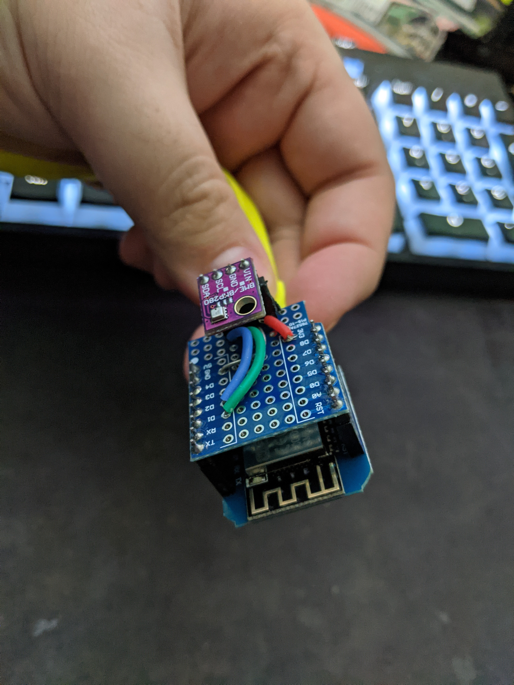
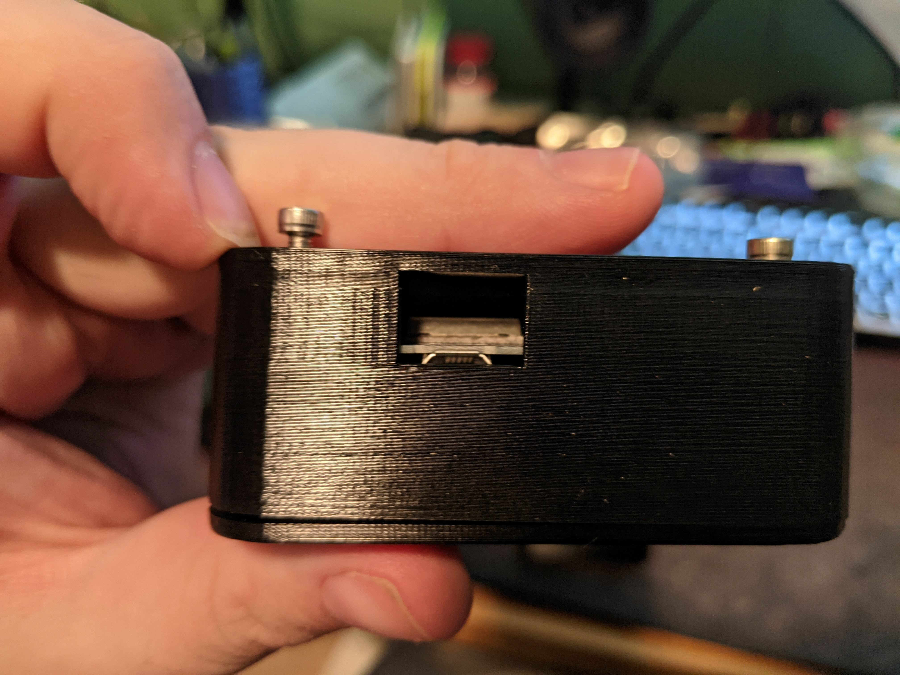
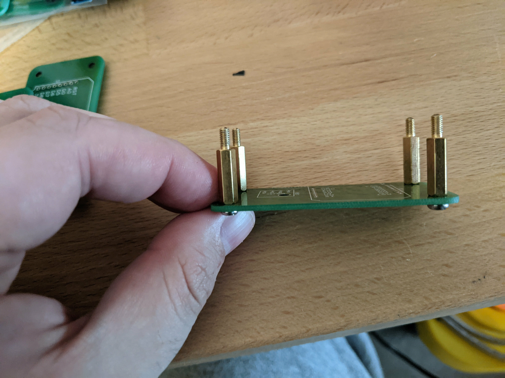
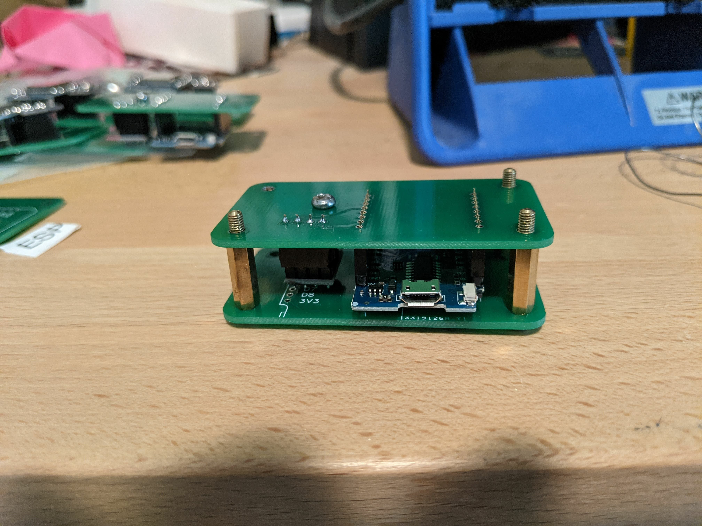
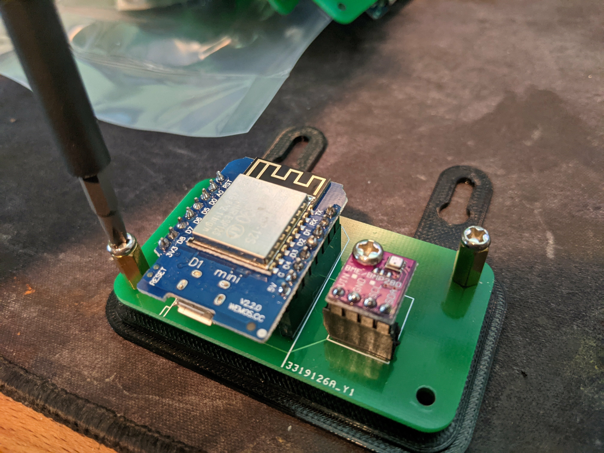
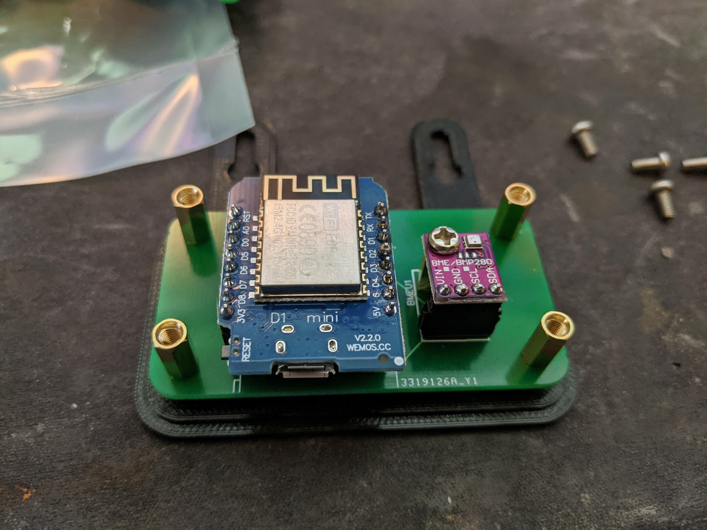
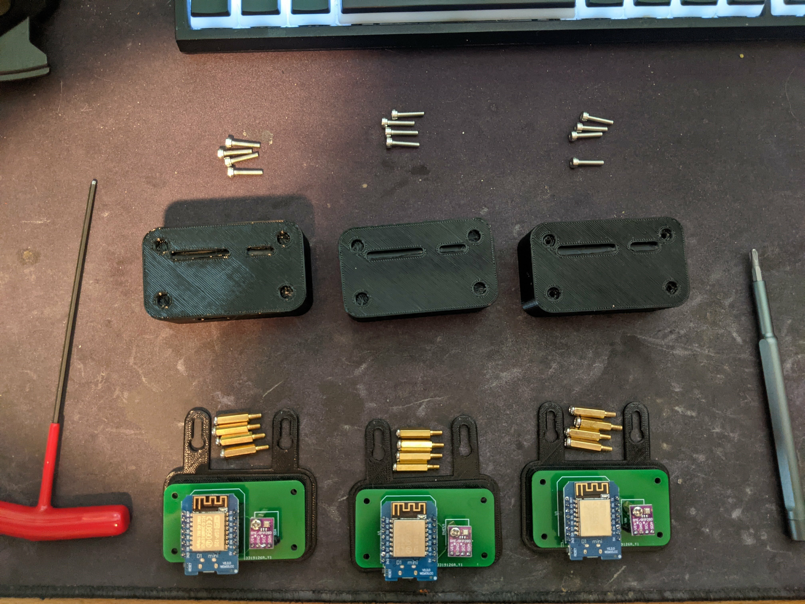
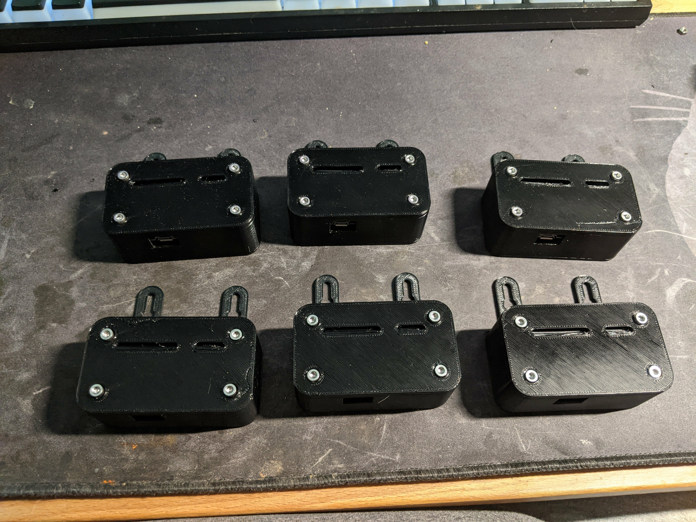

Thermo-stats
============

A personal project to log the temperatures of various areas in/around my home using custom smart devices.

Shopping List
-------------

Note, these are all pretty generic parts. Buy whatever brands suit your fancy - but the d1 mini type board and bme280 breakout listed are the expected form factors for everything. But if the link is out, buy from whatever seller you like that isn't.

The links aren't commissioned or anything, so do as you like.

* D1 Mini ESP8266 board - <https://www.amazon.com/s?k=d1+mini>
* BME280 breakout boards - <https://www.amazon.com/gp/product/B08J42JRLQ>
* IMPORTANT: Do not get BMP280 boards, since those don't do temperature
* PETG filament (if you wanna use outside/in direct sunlight)
* 4x 10mm+6mm M3 standoffs - <https://www.amazon.com/dp/B07WR5Q2SY>
* 4x 16mm M3 Socket-head screws - <https://www.amazon.com/dp/B07KRRG8HT>
* Screws/nails/whatever to mount to the wall
* USB micro cable for power - <https://www.amazon.com/gp/product/B01FSYBQ9Q>
* Wall outlet to usb adapter - <https://www.amazon.com/gp/product/B07DCR29GN>

You'll also need someplace to make the PCBs. I used <https://jlcpcb.com/> bacause they're cheap, good, and fast enough.

Setup InfluxDB for logging
--------------------------

The super short version here is use the docker-compose.yaml file in this repo. Map the IPs to something static and useful to you, and then just run `docker compose -d up`, go to <http://10.1.0.2:8086> or whatever you chose as your influxdb host, and configure a database.

I also prefer to set this to infinite retention, as the whole point of this is logging temperature/humidity/etc over long periods of time.

Once thats done, make sure you create an token with write access to said bucket.

Flashing devices
----------------

In `src/main.ino` you will find a block of code for editing, as shown here. Simply add in your wifi, influxdb, and timezone details - as well as the location name of the device - so that the graphs all get split up nicely in influxdb.

    // *****************************************************************************************************************
    // TODO: EDIT YOUR PERSONAL DATA HERE
    #define LOCATION "TEST"
    #define WIFI_SSID ""
    #define WIFI_PASSWORD ""
    #define INFLUXDB_URL ""
    #define INFLUXDB_TOKEN ""
    #define INFLUXDB_ORG ""
    #define INFLUXDB_BUCKET ""
    // Set timezone string according to https://www.gnu.org/software/libc/manual/html_node/TZ-Variable.html
    #define TZ_INFO "PST8PDT"
    unsigned long delayTime = 60000; // 1 minute
    // END EDITING
    // *****************************************************************************************************************

Writeup
=======

So, as many projects start, this started with a simple complaint: I don't know how hot/cold my garage gets, so I don't know what I can safely store out there. It'd be great to know that. And the attic too...

So, after a bit of tinkering and some research, I decided to make a full-on product: the Thermo-stats!

Its based on a ESP8266 for easy wifi reporting, phones home to an influxdb server for logging, and grafana for (future) prettier graphing, alerting, etc. And while I'm at it, might as well make it a portfolio project too!

The prototype
-------------

My prototyping went through a few sensors before I finally found the BME280. $5 for temperature, air pressure, and humidity logging, with 1 degree C accuracy - sounds pretty good. I also looked at the DHT22, but at around the same price, it seemed to have more complaints and was in a form factor that was more of a pain to mount.

So, started writing some code, built out on a breadboard, and assembled a hat for the d1 mini to test out the wiring and map out any problems.

This revealed that my code worked, and that I had a few problems.

1. The BME280 board floating without a screw to brace it looked... very breakable
2. I had no easy way to mount this in a case.
3. I had a few packs of sensors... and a bunch of d1 minis... and wanted to monitor EVERYTHING.
4. Wiring this by hand was... not fun. Wiring it a bunch of times would be even less fun.
5. Its a hobby project, so budget == whatever I'm comfortable with.

Designing the PCB
-----------------

So, I figured a PCB would solve all of my problems. It would let me add mounting holes for easy case design, it would greatly simplify soldering (and replacing components if any fail), and I already knew a cheap supplier thanks to their advertising on youtube.

Looking up how to design a pcb, I noticed that JLBPCB has their own software these days: EasyEDA. And... windows/mac/linux and free? Sounds like a good start. Oh, hey, first tutorial I find includes importing a pinout for a d1 mini into a project and building around it! <https://www.youtube.com/watch?v=MdcnkaAoDTE>

A few minutes later, I have my basic layout and wiring done - and about an hour of fiddling later I'm actually happy with it. Upon doing some reading up on other people with similar projects, I saw mentions that temperatures would slowly rise in a case... from the esp8266 generating heat next to the sensor.

So, in designing the PCB, I made sure to leave a gp between the parts so my case could put a separator in the middle to reduce this phenomenon. Placed my order on JLBPCB and gave myself until the boards arrived to finish the code and design the case.

I ordered 10, double-sided for lazier board design, and the whole bundle cost about $15 to get to my door. Lovely. Even only making 7 full boards, this ends up being about $2/unit vs the time of manually soldering together 7 of those prototype setups.

The Code
--------

At this point, I had a working prototype running micropython code, and just had to polish up and add the influxdb parts, as well as get the influxdb container running.

In between starting the project and getting to this point, people wrote better articles and example code for influxdb 2 containers, so I happily used that instead of the clunkier 1.8 that I started with. Huzzah. And then I went to get that working on micropython...

After a solid 3 days of trying everything I could to get the python library for influxdb to work in micropython, I rewrote this whole project in C and just used the influxdb library that worked out of the box.

Sadly, this had the side effect of not having easily managed config files, so hardcoded credentials in code! Yayyyy....

The case
--------

This gave me a LOT of trouble to design. This went through a good few iterations to solve a lot of the problems I'd built myself into.

1. Had to survive outside
2. Needed ventilation for chips that'd be somewhat rain-resistant
3. Needed a heat barrier between the circuit boards
4. Needed some sort of mounting feature
5. Had to have some way to open/close
6. Would be nice if the bottom piece worked as a bench testing setup

Fortunately, designing in EasyEDA let me export the PCB layout as a DXF file, which I could then import to fusion 360, extrude 1.6mm for the pcb and around 17mm total height for the end height of parts plugged in via standard pin headers. Then designed the case around these limits.

Of course... how it looks in the computer vs how it works in reality is not always as desired...

Additionally, the first try resulted in me creating the screw holes too small to actually tap into with m3 screws. 2.7mm diameter for m3 screws seemed to be the magic answer.

After assembling the first unit and testing it, it was time to do a small manufacturing run.

Assembly
--------

Step 1 of assembling is to do the soldering. While the BME280 board can be screwed in place with a 10mm tall riser and holds the pins nice and easily in place for soldering, dealing with the d1 mini was more tricky. However, the nice bit about having extra PCBs is you can put in 15mm m3 standoffs and make a quick and janky soldering fixture!

Just get one d1 mini with male pins soldered facing down (IE: for breadboard use) and push on female headers and make yourself a soldering sandwich as shown here. Then its quick and easy to just solder down the lines.

For installing the PCB onto the base, I use standoffs to screw down the PCB to the baseplate - then reuse that same screw layout for holding the lid down. If I was going to redo this - I'd redesign the case to take separate screws to attach the case - this is a major pain when trying to unscrew the lid, as the standoffs tend to unthread before the screws on the top of the case.

Installation was eased by using some m3 screws in the standoffs, and when your threading pressure suddenly becomes WAY higher, you've run out of thread and are now trying to drive the pcb through the plastic. So just stop and unscrew and the m3 screw will just pop out.

Then to get the longer m3 screws in, just put the lid on top, push the screws straight down, and start threading in by hand. I found it VERY easy to feel when you had threads engaging, and a light tug upwards on the screw confirmed that I'd successfully caught the standoff. Then just tighten the screws with a wrench.

Now, do some artful knolling to make sure you have enough hardware of all the right sizes (or adapt), and run off as many as you need to cover your needs.

